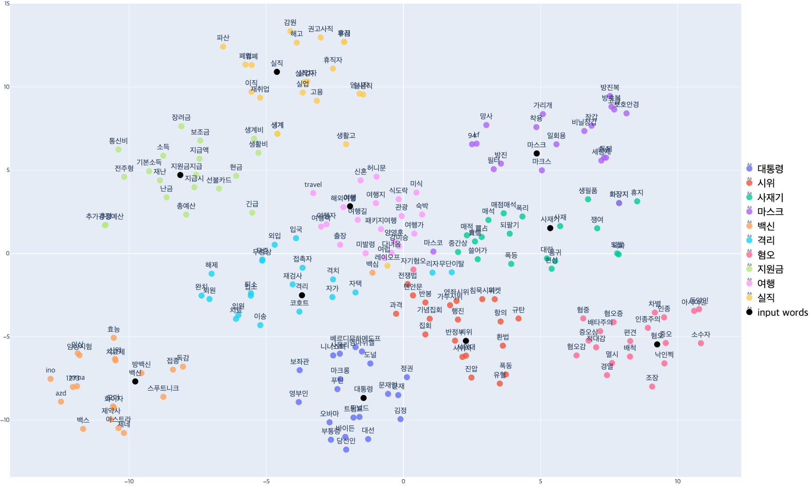

# 한국어, 영어 코로나바이러스 Word2Vec
참고: [한국어, 영어 코로나바이러스 Word2Vec 포스팅](https://hayul7805.github.io/projects/wordembedding-1/)

## 설명
- 준비물: 토크나이징과 전처리가 완료된 pickle 파일
  - 본 repo에서 사용한 데이터는 다음과 같습니다.
    - __영어__: BYU Coronavirus Corpus
      - 영어를사용하는 22개의 국가에서 발행된 코로나바이러스 관련 기사 텍스트
      - 2020년 미국에서 발행된 기사만 필터링(총 31만개의 기사)
    - __한국어__: 고려대학교 언어정보연구소에서 자체적으로 수집
      - 2020년 한 해 동안 발행된 151만개의 네이버 뉴스 기사 크롤링
- Word2Vec 모델의 기본적인 사용법과 시각화 방법을 다룹니다.
- 기본적인 사용법: `w2v_model_use.ipynb`
- 시각화: `w2v_model_visualization.ipynb`

## 결과물
아래의 시각화 결과는 t-SNE 방법을 사용한 것입니다. 

